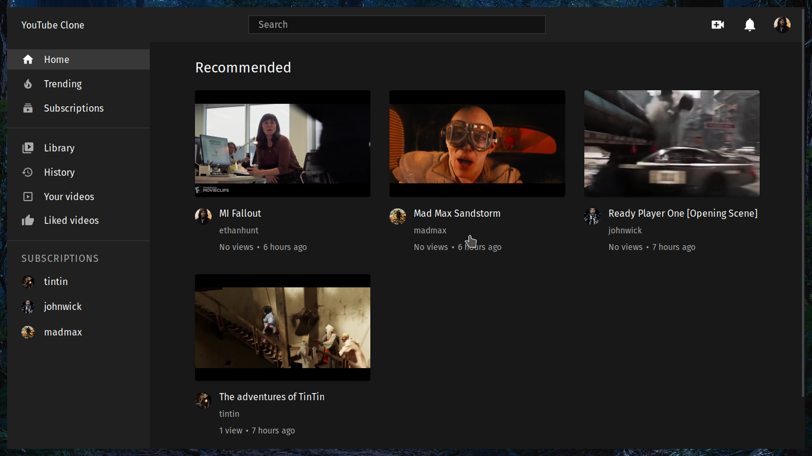
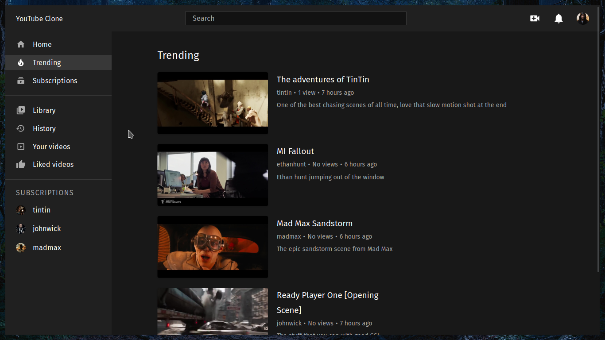
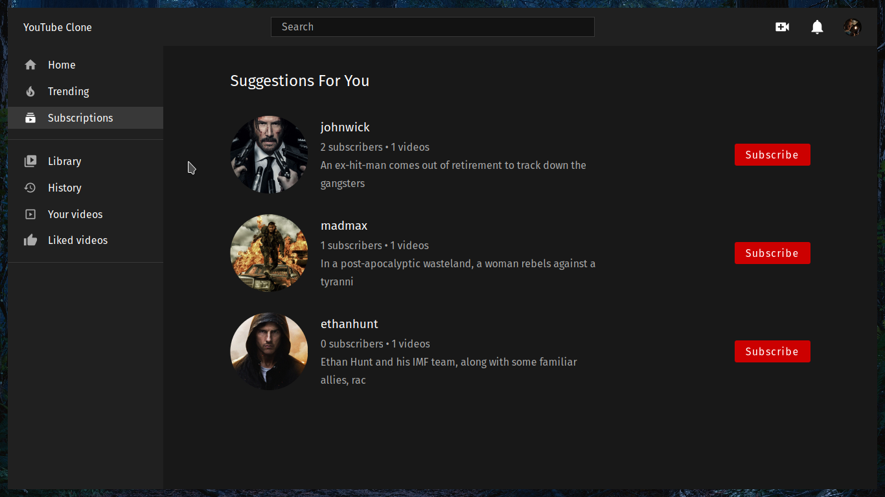
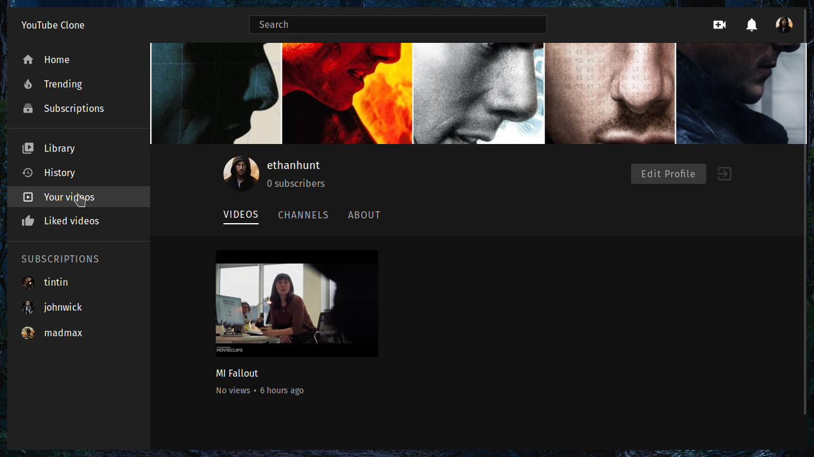
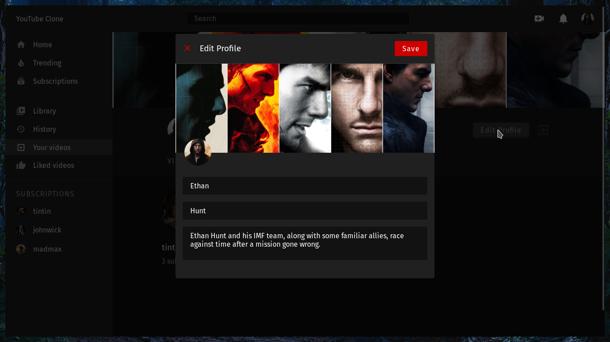
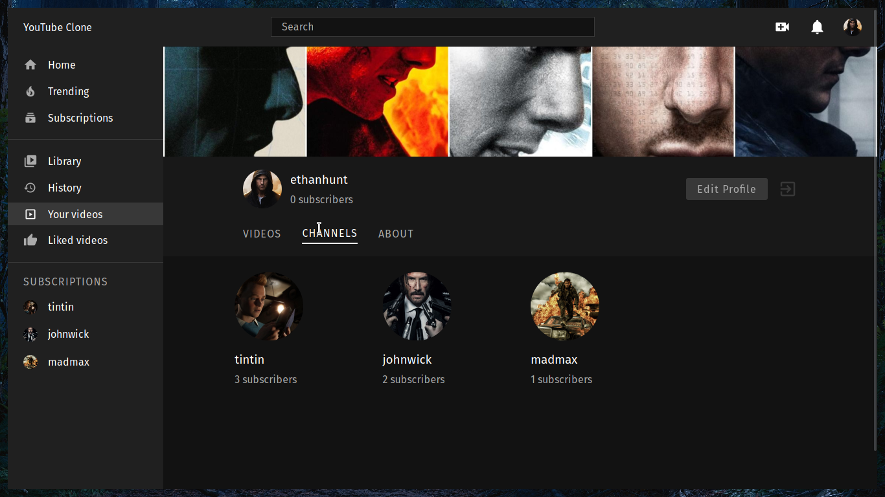
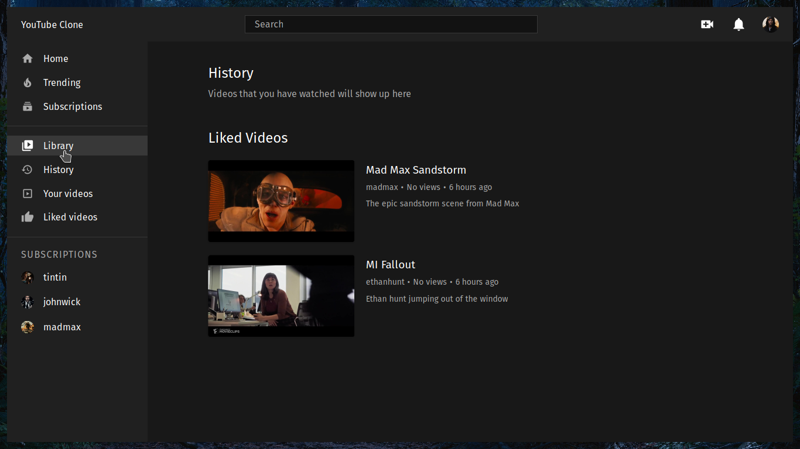
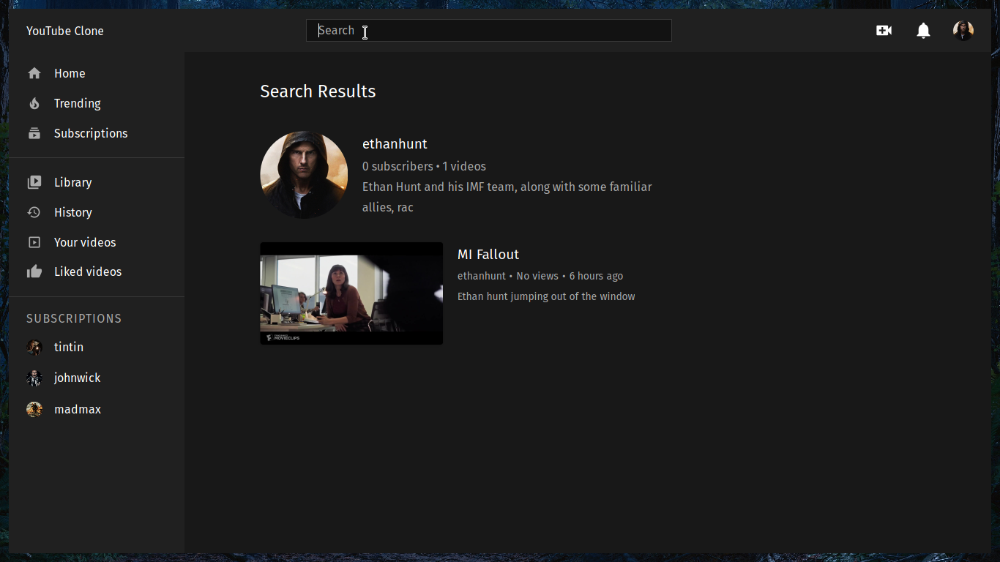

# Youtube Clone Frontend

**NOTE: As of 10-06-2022 at 20:00 IST, I am archiving this repository. It was fun while it lasted**.

Youtube clone using PERN stack (Postgres, Express, React, Node). 

This is the frontend repository, built with React + Redux. If you are looking for the backend repository, [click here](https://github.com/manikandanraji/youtubeclone-backend)

## Core packages

1. Redux - State Management
2. React Router - Routing
3. Styling - Styled Components
4. Toast Notifications - React Toastify
5. Network calls - Axios
6. Video player - Videojs

## Video uploads
I am using cloudinary for hosting videos and the thumbnails are generated automatically once we upload the video to cloudinary

## Features

1. Login/Signup
2. Upload video
3. Search video by channel name
4. Search video by title, description
5. Like/Dislike video
6. Subscribe/Unsubscribe from channels
7. Add comment
8. Edit profile (avatar, cover)
9. Liked videos
10. History

## Running locally

At the root of your project create an .env file with the following contents:

```bash
# BE stands for Backend Endpoint
REACT_APP_BE=<YOUR_BACKEND_ENDPOINT> # eg: http://localhost:5000/api/v1
REACT_APP_CLOUDINARY_ENDPOINT=https://api.cloudinary.com/v1_1/<YOUR_CLOUD_NAME>
```

Then run <code>npm i</code> and <code>npm start</code> to see the youtube clone in action

For more detailed instructions, [click here](https://github.com/manikandanraji/youtubeclone-frontend/wiki)

## Watch the Demo

[](https://youtu.be/wHLurtOnmyM "Youtube Clone Demo")

## UI

### Home



### Trending



### Watch


### Suggestions



### Channel



### Edit Profile





### Library



### Search



## My Clone Trilogy

With this clone, I am finishing what I call 'my clone trilogy'. If you are interested, you can visit my other clones that are part of this trilogy

1. Twitter

   - [Frontend](https://github.com/manikandanraji/twitter-clone-frontend)
   - [Backend](https://github.com/manikandanraji/twitter-clone-frontend)

2. Instagram
   - [Frontend](https://github.com/manikandanraji/instaclone-frontend)
   - [Backend](https://github.com/manikandanraji/instaclone-backend)
